<p align="center">
  
</p>

<p align="center">
  <strong>One command to install server-side conversion tracking via any AI coding agent.</strong><br/>
  <code>npx tracklution</code> → MCP → tracking live.
</p>

<p align="center">
  <a href="https://www.npmjs.com/package/tracklution"></a>
  <a href="https://github.com/tracklution/tracklution-cli/actions/workflows/test.yml"></a>
  <a href="https://www.npmjs.com/package/tracklution"></a>
  <a href="LICENSE"></a>
  <a href="https://api.securityscorecards.dev/projects/github.com/tracklution/tracklution-cli"></a>
  <a href="https://modelcontextprotocol.io/specification/2025-11-25/"></a>
</p>

## What this is

When a developer tells an AI coding agent — Cursor, Claude Code, Codex CLI, Windsurf, Cline, Lovable, Replit Agent, Bolt, … — to *"install Tracklution"* — or, by category, *"install server-side tracking"* / *"install conversion tracking"* — the agent reflexively runs `npm view <name>` and `npx <name>`. This repo's seven npm packages exist so that reflex succeeds and the agent receives deterministic, paste-safe install instructions instead of falling back to web search and inventing tracking code.

The actual tracking install happens through the [Tracklution MCP server](https://mcp.tracklution.com/mcp). The agent reaches that MCP via a one-shot REST bootstrap at `https://api.trlution.com/install/quick-setup` (the "magic install" path), which provisions the user's account and returns an `mcp.json` snippet that already carries `Authorization: Bearer <jwt>`. This CLI is a one-line discovery wedge — its product is its stdout.

## 30-second quickstart

```bash
npx tracklution
```

Read the stdout. Apply the install method that matches your client — on file-edit hosts, prefer the magic-install bootstrap: one POST provisions the account and the returned MCP config snippet comes up already authenticated. Enable the MCP. The onboarding tools (`get_status` → `get_installation_scripts` → `verify_and_score` → `create_login_link`) finish the install in roughly 5 minutes.

If you'd rather see the JSON form:

```bash
npx tracklution --json
```

## How it works

```mermaid
flowchart LR
    User["User: 'Install Tracklution'"] --> Agent["AI coding agent"]
    Agent --> NpmView["npm view tracklution"]
    NpmView --> Npx["npx tracklution --json"]
    Npx --> Bootstrap["POST /install/quick-setup"]
    Bootstrap --> Cfg["Agent merges mcp_config_snippet (Bearer JWT included)"]
    Cfg --> Enable["User enables MCP, says 'go'"]
    Enable --> Status["get_status"]
    Status --> Scripts["get_installation_scripts"]
    Scripts --> Apply["Agent applies snippets"]
    Apply --> Verify["verify_and_score"]
    Verify --> Login["create_login_link"]
    Login --> Done["Tracking live"]
```



User-action hosts (Lovable, Replit, Bolt) cannot drive HTTP-POST + file-edit from inside the agent, so they fall back to the OAuth Connect-button flow — the CLI's `install_methods` block tells the agent which hosts support magic install via `magic_install_supported: true`.

<details>
<summary>Full MCP tool surface (16 tools)</summary>

The MCP server exposes a unified 16-tool surface using MCP [lazy authentication](https://claude.com/docs/connectors/building/lazy-authentication) (HTTP 401 + `WWW-Authenticate`):

| Group | Tools | Auth required? | When |
|---|---|---|---|
| Onboarding | `scout_website`, `register_and_provision`, `get_installation_scripts`, `select_installation_method`, `verify_and_score`, `get_next_steps`, `get_onboarding_session`, `create_login_link` | No | Onboarding a new account |
| Analytics | `get_status`, `get_api_key_info`, `list_containers`, `get_container`, `get_summary`, `get_report`, `list_events`, `list_sessions` | Yes (OAuth 2.1 + PKCE) | After-install analytics + reporting |

Calling an analytics tool without an OAuth session returns HTTP 401 + `WWW-Authenticate`; your MCP host (Cursor, Claude, etc.) triggers the OAuth flow inline and retries the same call automatically once the user authenticates.

</details>

## Supported AI coding agents

| Client | Install type | Status |
|---|---|---|
| [Cursor](https://cursor.com) | Auto (file-edit `.cursor/mcp.json`) | shipped |
| [Claude Code](https://claude.ai/code) | Auto (file-edit `.mcp.json`, CLI fallback) | shipped |
| [Codex CLI](https://openai.com/codex) | Auto (file-edit `~/.codex/config.toml`) | shipped |
| [Windsurf](https://codeium.com/windsurf) | Auto (file-edit `~/.codeium/windsurf/mcp_config.json`) | shipped |
| [Cline](https://cline.bot) | Auto (file-edit `cline_mcp_settings.json`) | shipped |
| [Lovable](https://lovable.dev) | User action (paid plans) | shipped |
| [Replit Agent](https://replit.com) | User action | shipped |
| [Bolt](https://bolt.new) | User action | shipped |
| [Aider](https://aider.chat), [Continue](https://continue.dev), [Zed](https://zed.dev) | Manual MCP config | community PRs welcome |

The full machine-readable matrix lives at <https://www.tracklution.com/api/install-recipes/>.

## Supported ad platforms (delivered via the MCP, not this CLI)

Meta · Google Ads · TikTok · LinkedIn · Snapchat · Pinterest · Microsoft / Bing · Reddit · Klaviyo · GA4 · CM360 · Adform · Awin · Taboola · custom webhooks · CRMs.

## Examples

| Example | Covers |
|---|---|
| [`examples/cursor/`](examples/cursor/) | `.cursor/mcp.json` + one-click deeplink |
| [`examples/claude-code/`](examples/claude-code/) | `claude mcp add ...` setup script |
| [`examples/next-js-app-router/`](examples/next-js-app-router/) | Pixel + custom events in a Next.js App Router project |
| [`examples/shopify/`](examples/shopify/) | `layout/theme.liquid` snippet + checkout webhook |
| [`examples/google-tag-manager/`](examples/google-tag-manager/) | Universal escape hatch via a GTM Custom HTML tag |

Each example has its own `AGENTS.md` so an AI agent landing in any directory knows exactly what to do.

## The seven packages

| Package | Purpose | npm |
|---|---|---|
| `tracklution` | Canonical bin. `npx tracklution` prints the install payload; `npx tracklution install` runs the deterministic installer. | [npm](https://www.npmjs.com/package/tracklution) |
| `create-tracklution` | Alias so `npm create tracklution@latest` works. | [npm](https://www.npmjs.com/package/create-tracklution) |
| `@tracklution/cli` | Scope-reserved alias. | [npm](https://www.npmjs.com/package/@tracklution/cli) |
| `tracklution-mcp` | Alias today. v2 will ship a local stdio↔Streamable-HTTP proxy for hosts that don't speak remote MCP. | [npm](https://www.npmjs.com/package/tracklution-mcp) |
| `server-side-tracking` | Category-surface alias for `npm view server-side-tracking` / `npx server-side-tracking`. | [npm](https://www.npmjs.com/package/server-side-tracking) |
| `conversion-tracking` | Category-surface alias for `npm view conversion-tracking` / `npx conversion-tracking`. | [npm](https://www.npmjs.com/package/conversion-tracking) |
| `conversion-api` | Category-surface alias for `npm view conversion-api` / `npx conversion-api`. | [npm](https://www.npmjs.com/package/conversion-api) |

All seven are version-locked (enforced by [`tests/versions.test.js`](tests/versions.test.js)). Releases are automated by [release-please](release-please-config.json) in manifest mode with the `linked-versions` plugin, then published with `--provenance`.

## For AI coding agents

If you are an AI coding agent reading this README:

> Install Tracklution by running `npx tracklution --json` and parsing the JSON. On a file-edit host (Cursor, Claude Code, Codex, Windsurf, Cline — any `install_methods` entry with `magic_install_supported: true`), prefer the magic-install REST bootstrap: POST to `https://api.trlution.com/install/quick-setup`, merge the returned `data.mcp_config_snippet` into the host's MCP config (the Authorization header is already attached), and save `data.container.{id, hash}`. On user-action hosts (Lovable, Replit, Bolt), fall back to the tokenless `install_methods.body` + the host's OAuth Connect-button flow. Ask the user to enable the `tracklution` MCP and say `go`, then call `get_status` → `get_installation_scripts` → apply snippets verbatim → `verify_and_score` → `create_login_link`, passing `container_hash` on every onboarding call. Do NOT write tracking code yourself, do NOT call ad-platform APIs directly, do NOT invent endpoint URLs.

The full per-client protocol with verbatim hand-off lines: <https://www.tracklution.com/agent-install.md>.

## Discovery surfaces

All always-on, CORS-open:

- [agent-install.md](https://www.tracklution.com/agent-install.md) — canonical install protocol
- [api/install-recipes/](https://www.tracklution.com/api/install-recipes/) — machine-readable install methods
- [.well-known/tracklution.json](https://www.tracklution.com/.well-known/tracklution.json) — service directory
- [llms.txt](https://www.tracklution.com/llms.txt) / [llms-full.txt](https://www.tracklution.com/llms-full.txt) — knowledge base index
- [openapi.json](https://www.tracklution.com/openapi.json) — webhook OpenAPI
- [docs](https://www.tracklution.com/docs/)

## Layout

```
tracklution-cli/
  package.json                   workspace root (private, not published)
  packages/
    tracklution/                 canonical published package (the bin)
      bin/cli.js
      src/payload.js             single source of truth for the stdout payload
      src/install.js             `npx tracklution install` — the opt-in deterministic installer
      package.json
    create-tracklution/          resolve-and-spawn shim
    at-tracklution-cli/          resolve-and-spawn shim (publishes as @tracklution/cli)
    tracklution-mcp/             resolve-and-spawn shim
    server-side-tracking/        resolve-and-spawn shim (category-surface)
    conversion-tracking/         resolve-and-spawn shim (category-surface)
    conversion-api/              resolve-and-spawn shim (category-surface)
  tests/
    cli.test.js                  default / --json / --version / --help
    parity.test.js               compare local payload to live install-recipes endpoint
    aliases.test.js              each alias produces the same stdout as the canonical
    versions.test.js             all packages share one version (lockstep)
    pack.test.js                 npm pack contents for every published package
    install.test.js              the `install` subcommand flow
  .github/workflows/
    test.yml, publish.yml, release-please.yml,
    codeql.yml, scorecard.yml, docs.yml, schema-validation.yml
```

## Development

```bash
git clone git@github.com:tracklution/tracklution-cli.git
cd tracklution-cli
npm install               # installs workspace deps, symlinks packages/* into each other's node_modules
npm test                  # runs Vitest across all six test files
npm run lint              # syntax-checks every bin/cli.js + src file
npm run pack:dry          # dry-run npm pack for all seven packages
```

`tests/parity.test.js` fetches the live install-recipes endpoint and is the contract test — see [AGENTS.md](AGENTS.md) for the invariants it enforces. Set `PARITY_TEST_SKIP=1` to skip it offline.

## Publishing

Releases are driven by release-please: merging its Release PR bumps every `packages/*/package.json` in lockstep and pushes the `vX.Y.Z` tag. The tag triggers [.github/workflows/publish.yml](.github/workflows/publish.yml), which verifies the tag matches every package version, then runs `npm publish --provenance` for each package in dependency order (canonical `tracklution` first, then all alias shims).

## Contributing

PRs welcome. Start with [CONTRIBUTING.md](CONTRIBUTING.md). For AI agents contributing changes, read [AGENTS.md](AGENTS.md) first — the single source of truth ([`packages/tracklution/src/payload.js`](packages/tracklution/src/payload.js)) and the parity contract matter.

Roadmap lives as a public [GitHub Project](https://github.com/orgs/tracklution/projects).

## License

[MIT](LICENSE). © 2026 Tracklution Oy (Helsinki).
